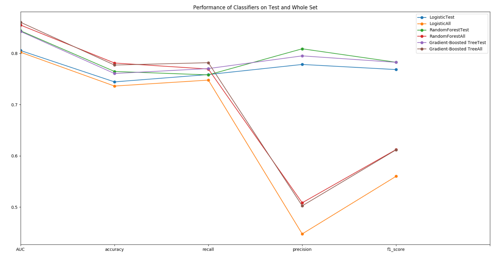

# Sparkify_Churn_Project_with_AWS_EMR
  
## Motivation
In our previous repository, we explored Sparkify dataset with medium size using pyspark. In this project, we make use of Amazon Web Sevice's EMR technology accompanied with Spark to further investigate the full dataset (which is as large as 12GB).

## Introduction
In order to analyze the full dataset efficiently, we created EMR clusters with Spark in AWS and attached the EMR_notebook to this Git Repository. The complete process is documented in medium post. Please have a look at <a href='https://burgercewu.medium.com/create-aws-emr-notebook-with-spark-and-attach-it-to-git-repo-for-version-control-a169c12ad79'>here</a>. We then use pyspark kernel and Jupyter notebook for coding and visualization. The goal of this project is to predict if a user will churn or not on the basis of past event and activity log. If we could accurately predict potentially churning users, we could provide promotion or special offer to those users before they make up their mind churning.

## Dataset
In this notebook, we use a subset of the full dataset for modeling. The schema of this dataframe is as below.
```
|-- artist: string (nullable = true) 
|-- auth: string (nullable = true) 
|-- firstName: string (nullable = true) 
|-- gender: string (nullable = true) 
|-- itemInSession: long (nullable = true) 
|-- lastName: string (nullable = true) 
|-- length: double (nullable = true) 
|-- level: string (nullable = true) 
|-- location: string (nullable = true) 
|-- method: string (nullable = true) 
|-- page: string (nullable = true) 
|-- registration: long (nullable = true) 
|-- sessionId: long (nullable = true) 
|-- song: string (nullable = true) 
|-- status: long (nullable = true) 
|-- ts: long (nullable = true) 
|-- userAgent: string (nullable = true) 
|-- userId: string (nullable = true) 
```

## Libraries Used
- re (Regular Expression)
- pyspark (Spark interface for Python)
- pandas (Dataframe manipulation)
- matplotlib (Plotting)
- seaborn (Advanced Plotting)

## Files and Folders
- images(image storage)
- Sparkify_Pyspark.ipynb (Notebook for the project)
- Sparkify_Pyspark.html (HTML for the Notebook)

## Summary
After analyzing full dataset, we found that most variables we investigate do not have significant difference to the medium dataset. Perhaps this means nediumn dataset is chosen from full dataset in a homogeneous way and thus analyzing medium dataset may already be acceptable. The regression result of full dataset is a bit better for test set evaluation (up to 0.78 f1 score). As for evaluation on whole dataset, the best f1 score decreased to 0.61%. In my opinion, the way we deal with imbalance dataset is still not enough. Most unchurned users are not recognized by the model, leading to false positives. 



## Acknowledgement
Special thank to Udacity for providing the dataset and to AWS for providing amazing tools for big data analysis
